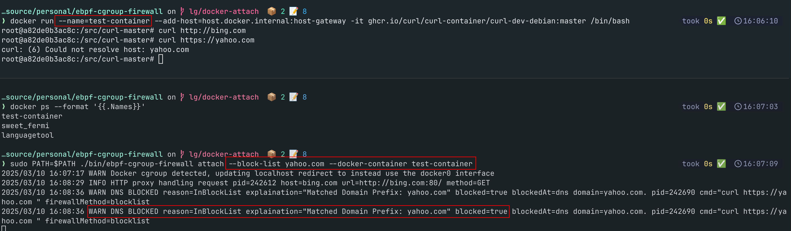

# eBPF CGroup Outbound Firewall

Doesn't it suck that firewalls are IP based and you can't easily track which process made a request?

This projects aims fix that.

It gives a simple, easy, **outbound firewall accepting DNS names, URLS or IPs for block/allow lists**.

Most firewalls inspect trafic at the whole machine, making it feel like a needle in a haystack when looking for a single programs activity.

**This works on a process**, or group of process, **to give you control over what individual programs can reached out to** when you run.

It does this by using:

- eBPF to intercept [DNS requests](https://docs.ebpf.io/linux/program-type/BPF_PROG_TYPE_CGROUP_SOCK_ADDR/) and [allow/block packets](https://docs.ebpf.io/linux/program-type/BPF_PROG_TYPE_CGROUP_SKB/)
- [socket cookies](https://docs.ebpf.io/linux/helper-function/bpf_get_socket_cookie/) and [DNS Transaction IDs](https://beta.computer-networking.info/syllabus/default/protocols/dns.html) to correlate which command made a request and tracks which IP's resolved from which domains
- [cGroups](https://man7.org/linux/man-pages/man7/cgroups.7.html) to target a single process or group of linux processes
- [goproxy](https://github.com/elazarl/goproxy) to intercept HTTP and HTTPS traffic

For each url, dns request or packet this means it has:
- The command which initiated it and it's PID `ip=1.1.1.1 ipResolvedForDomains="No Domains"` vs `ip=142.250.187.206 ipResolvedForDomains=google.com`
- The IP requested and which DNS request resolved to it `pid=56253 cmd="curl --max-time 1 1.1.1.1 || curl google.com "`
- Why the decision was made ie. `explaination="Matched Domain Prefix: google.com" blocked=true blockedAt=dns domain=google.com`

> Note: Currently we do not support IPv6 and drop all `AAAA` records from DNS then block any `AF_INET6` requests in egress.

## Example Usage

Try it out, here are some examples

To use HTTPS interception you first need to [run `mkcert --install`](https://github.com/FiloSottile/mkcert) to create a root CA for intercepting and decoding HTTPS requests. This is already done for you in the devcontainer if you'd like to try it out there.

### Allow `https://github.com/lawrencegripper` only but no other github traffic

Here was allow only the HTTP traffic on specfic url `https://github.com/lawrencegripper`:

`./bin/ebpf-cgroup-firewall run --allow-list 'https://github.com/lawrencegripper' "curl https://github.com/lawrencegripper"`

The request suceeeds ✅

If we try another url `https://github.com/github`:

`./bin/ebpf-cgroup-firewall run --allow-list 'https://github.com/lawrencegripper' "curl https://github.com/github"`

The request fails ❌

The firewall detects that you are only asking for HTTP traffic so will also block any non-http traffic to that domain.

`./bin/ebpf-cgroup-firewall run --allow-list 'https://github.com/lawrencegripper' "nc -zv -w 1 github.com 22"`

Here, connecting to the SSH port, when only that url is allowed, is blocked ❌

### Block `google.com`

This will block any connections on any ports to `google.com`

`./ebpf-cgroup-firewall run --block-list google.com "curl google.com"`

> WARN DNS BLOCKED reason=FromDNSRequest explaination="Matched Domain Prefix: google.com" blocked=true blockedAt=dns domain=google.com. pid=266767 cmd="curl google.com " firewallMethod=blocklist
>

### Attach to a Docker Container and block calling `yahoo.com` from the container

1. Start a container `docker run --name=test-container -it ghcr.io/curl/curl-container/curl-dev-debian:master /bin/bash`
2. Attach the egress firewall `sudo PATH=$PATH ./bin/ebpf-cgroup-firewall attach --block-list yahoo.com --docker-container test-container`
   - Note: `PATH` is passed to sudo as `mkcert` for me isn't in `root` users path as installed from `brew`
3. Run `curl yahoo.com` inside the container and observe it's blocked
4. Run `curl bing.com` inside the container and observe it's allowed



### Allow mix of DNS and IP Addresses

`./ebpf-cgroup-firewall run --block-list 1.1.1.1,google.com "curl 1.1.1.1 || curl google.com"`

> WARN Packet BLOCKED blockedAt=packet blocked=true ip=1.1.1.1 ipResolvedForDomains="No Domains" pid=56253 cmd="curl --max-time 1 1.1.1.1 || curl google.com " reason=UserSpecified explaination="Blocked IP as on explicit block list" firewallMethod=blocklist
>
> curl: (28) Connection timed out after 1004 milliseconds
>
> WARN DNS BLOCKED reason=FromDNSRequest explaination="Matched Domain Prefix: google.com" blocked=true blockedAt=dns domain=google.com. pid=56253 cmd="curl --max-time 1 1.1.1.1 || curl google.com " firewallMethod=blocklist
>
> curl: (6) Could not resolve host: google.com

### Attach to the current CGroup only allowing `google.com` then `curl bing.com` in another terminal

`systemd` runs a cgroup per login session so attaching to that current group applies the firewall
to all processes that the user is running.

Here we see `ebpf-cgroup-firewall attach` in one terminal and the `curl` in another terminal/process being blocked.


## How does it work?

1. When a call UDP request is made on port 53 the eBPF program (`cgroup/connect4`) redirects it to the userspace DNS proxy.

   It captures the PID from the process that made the request and `Transaction ID` from the DNS request.

   The PID is tracked via a socket cookie so we can retrieve it in another eBPF program which is
   intercepting packets (`cgroup_skb/egress`).

2. The userspace DNS proxy resolves the domains IP via downstream DNS server and, if allowed by the 
   rules, adds the IP to the allowlist for `cgroup/connect4` which means outbound calls can be made to the IP.

   It uses the `transaction id` capture in eBPF to correlate the DNS request to the PID that submitted it.
    
   This means we have rich information about the originating program, such as the command run and why it triggered a block.

   > WARN DNS BLOCKED reason=FromDNSRequest explaination="Matched Domain Prefix: google.com" blocked=true blockedAt=dns domain=google.com. pid=52031 cmd="curl -s --max-time 1 google.com " firewallMethod=blocklist

3. `cgroup_skb/egress` ensures that, even a program can work around the DNS Proxy, the request would be blocked at the packet level as the IP would not be in the allowed allowlist.

    We can show this by running with `--allow-dns-request` which tells the DNS proxy to resolve the IP but not add it to the allowlist.

    > $> ebpf-cgroup-firewall run --block-list google.com --allow-dns-request "curl -s --max-time 1 google.com"

    > WARN Packet BLOCKED blockedAt=packet blocked=true ip=142.250.187.206 ipResolvedForDomains=google.com. pid=52061 cmd="curl -s --max-time 1 google.com " reason=FromDNSRequest explaination="Matched Domain Prefix: google.com" firewallMethod=blocklist

4. The HTTP Proxy will evaluate if any URLs where in the allow/block list and either proxy them to their destination of deny them.

## Logs

The firewall provides detailed logging for different types of requests:

- DNS
   `{"time":"2025-03-14T12:53:08.600372446Z","level":"WARN","msg":"DNS BLOCKED","because":"NotInAllowList","blocked":true,"blockedAt":"dns","domains":"google.com.","ruleSource":"MatchedBlockListDomain","ruleSourceComment":"Domain matched blocklist prefix: google.com","pid":0,"port":"53","ip":"","originalIp":"unknown","url":"","cmd":"some-command"}`
- HTTP/S
   `{"time":"2025-03-14T12:55:55.10990631Z","level":"WARN","msg":"HTTP BLOCKED","because":"MatchedBlockListDomain","blocked":true,"blockedAt":"http","domains":"bing.com","ruleSource":"MatchedBlockListDomain","ruleSourceComment":"Matched URL Prefix: https://bing.com/bob","pid":351020,"port":"","ip":"","originalIp":"","url":"https://bing.com/bob","cmd":"curl -s --fail-with-body --output /dev/null --max-time 5 https://bing.com/bob "}`
- Packet 
   `{"time":"2025-03-14T12:51:09.104331257Z","level":"WARN","msg":"PACKET BLOCKED","because":"IPNotAllowed","blocked":true,"blockedAt":"packet","domains":"None","ruleSource":"Unknown","ruleSourceComment":"Unknown","pid":0,"port":"80","ip":"96.7.128.175","originalIp":"96.7.128.175","url":"","cmd":"unknown"}`

See [./pkg/logging/request.go](./pkg/logger/request.go) for details on the fields that are available. For example, `because` has a [set of defined values](https://github.com/lawrencegripper/ebpf-cgroup-firewall/blob/474012ed809ad12c333732a5a1b61a5369d6e630/pkg/logger/request.go#L32-L38).

With the `--log-file` parameter these are outputted to JSON so can be parsed with `jq` to
get detailed information.

Logs include correlating the request back to the `pid` and `cmdline` which caused it to be made, along with `ruleSource` and `ruleSourceComment` which explain why it was blocked.

`pid` will be `-1` if the eBPF has been unable to correlate the request to a process.

### Examples

1. To see all DNS level blocking

   ```
   firewall-log.jsonl | jq -c 'select(.blocked==true and .blockedAt=="dns") | .domains'
   "raw.githubusercontent.com."
   "raw.githubusercontent.com."
   ```

2. To see all URL level blocks

   ```
   firewall-log.jsonl | jq -c 'select(.blocked==true and .blockedAt=="http") | .url'
   ```

### Detailed/Debug

With `--debug` provided you'll receive additional logs, including details of requests which are allowed.

These will include `eventType` and detail when eBPF has redirected or allowed a request to bypass a set of rules.

See [logRedirectOrBypass](./pkg/ebpf/events.go) function for more details on the information present.

```
{"time":"2025-03-14T12:53:08.607137613Z","level":"INFO","msg":"DNS Redirect","eventType":"DNS Redirect","ip":"127.0.0.1","originalIp":"127.0.0.1","port":37020,"pid":347052,"cmd":"curl -s --fail-with-body --output /dev/null --max-time 1 google.com ","dnsTransactionId":0}
{"time":"2025-03-14T12:53:08.604595069Z","level":"INFO","msg":"DNS Proxy Packet Bypass","eventType":"DNS Proxy Packet Bypass","ip":"127.0.0.1","originalIp":"127.0.0.1","port":37020,"pid":347052,"cmd":"curl -s --fail-with-body --output /dev/null --max-time 1 google.com ","dnsTransactionId":15224}
```